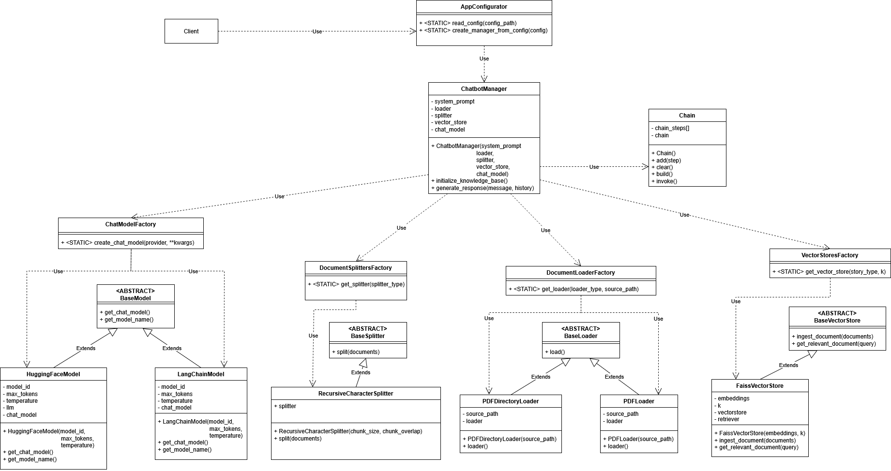

# Chatbot-RAG
A modular Retrieval-Augmented Generation (RAG) chatbot framework designed to provide grounded and context-aware responses by integrating external document retrieval with Large Language Models using LangChain framework.

---

## Project Overview

This project implements a complete RAG pipeline, allowing users to query their own documents and receive answers based strictly on the provided data. The system is designed with a focus on scalability and flexibility, ensuring that individual components can be swapped or upgraded without refactoring the entire codebase.

## System Architecture

The following UML class diagram illustrates the modular design of the system, highlighting the use of Factory and Strategy patterns to decouple document loading, vector storage, and model integration.



## Project Structure and Modularity

The repository follows a strict modular design pattern to separate concerns and facilitate maintenance:

### 1. Ingestion and Multi-Format Support
The ingestion module is built to be extensible through the `DocumentLoaderFactory`.
* **Currently Supported**: The system is pre-configured with `PDFLoader` and `PDFDirectoryLoader` to handle PDF documents.
* **Extensibility**: By extending the `BaseLoader` abstract class, support for new formats (such as .txt, .docx, or .md) can be added without modifying the core `ChatbotManager`.

### 2. Model Factory and LLM Integration
The `ChatModelFactory` manages the instantiation of different language models. 
* **Supported Providers**: Current implementations include `HuggingFaceModel` and `LangChainModel` providers.

### 3. Vector Database Management
The `VectorStoresFactory` handles the creation of storage solutions. 
* **Current Implementation**: Uses `FaissVectorStore` (based on FAISS) for efficient similarity search.
* The system is designed to support any vector database that implements the `BaseVectorStore` interface.

### 4. Chatbot Manager and Chain Logic
The `ChatbotManager` acts as the orchestrator, utilizing a `Chain` component to manage the flow of information between the retriever and the generative model.

---

## Installation

1. Clone the repository:
   ```bash
    git clone https://github.com/mbcienz/Chatbot-RAG.git
    cd Chatbot-RAG

2. Create and activate a virtual environment:
    ```bash
    python -m venv venv
    source venv/bin/activate  # On Windows use: venv\Scripts\activate

3. Install the required dependencies:
    ```bash
    pip install -r requirements.txt

4. **Environment Variables Setup**: create a `.env` file in the root directory of the project to securely store your API keys. Add the following tokens:
   ```env
   GOOGLE_API_KEY=your_google_api_key_here
   HUGGINGFACEHUB_API_TOKEN=your_huggingface_token_here
---

## Configuration
The entire application is highly customizable without touching the Python code. All configurable parameters of the app are settable directly from the `config.json` file. This includes settings for the **model providers**, **LLM parameters**, **vector stores**, **text splitters**, and **document loaders**.

### Supported Providers and Models
Through the `config.json`, you can define which LLM provider and model to use. The currently supported provider keys are:

* **`hf`**: uses native Hugging Face models via the HuggingFace endpoint.
* **`langchain`**: utilizes LangChain's universal `init_chat_model` function. This allows the framework to theoretically support *all* providers and models supported by LangChain. 
  * When using the `langchain` provider, you must insert the model in the exact `provider:model_id` format. For example: `google_genai:gemini-2.5-flash-lite`.

*Note: while the `langchain` integration makes it possible to support all models available in the LangChain ecosystem, currently only the Hugging Face (`hf`) and Google (`google`) models have been explicitly tested and supported. However, extending support to other models is fully possible.*

## Usage

### Data Preparation
To index your documents (currently supporting PDF files), place your source files in the designated data directory as defined in your `config.json`.
### Running the Application

To start the chatbot interface or CLI:
```bash
    python main.py
```

## Technical Features

* **Abstract Factory Pattern**: ensures that components (Models, Loaders, Vector Stores) are created consistently and are easily swappable.
* **Flexible Document Parsing**: designed to support multiple data sources beyond the current PDF implementation.
* **Customizable Chunking**: uses `RecursiveCharacterSplitter` via `DocumentSplittersFactory` for optimal context window management.
* **Agnostic LLM Integration**: decoupled from specific providers to prevent vendor lock-in, supporting both HuggingFace and LangChain providers dynamically via JSON configuration.

## License

Refer to the LICENSE file in the repository for details on usage rights and restrictions.